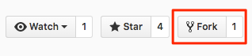
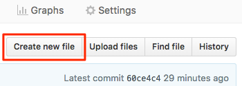
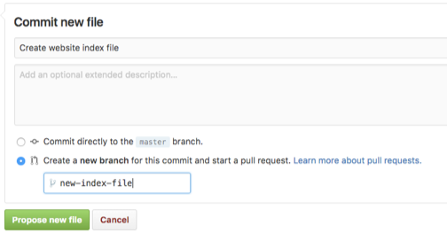
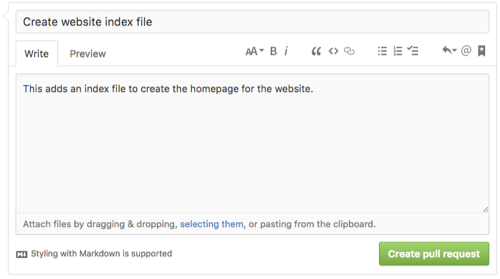
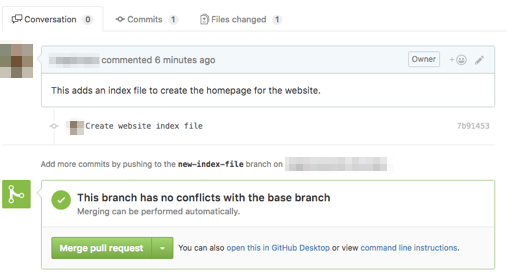
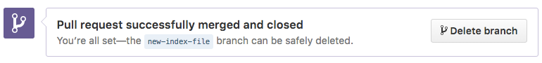
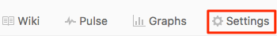
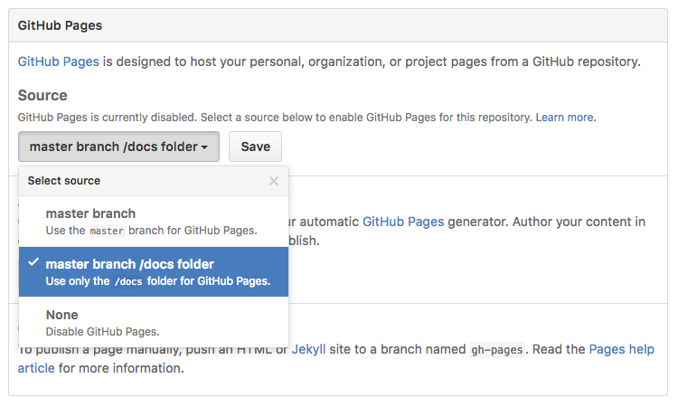
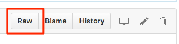
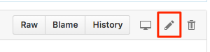

# Tutorial: Learn GitHub by building a website

GitHub is a website that enables people to collaborate on projects, and many organizations use it for managing both software code and documentation. You will get started with GitHub by applying its tools to creating a website.

In this tutorial, you will:

- Get an introduction to the Git version control system, terminology, and the GitHub workflow.
- Create a simple website with the free hosting service from GitHub, called GitHub Pages.
- Learn how you can take your new skills and to support other open-source projects.

To complete the tutorial, you need a [GitHub account](https://help.github.com/articles/signing-up-for-a-new-github-account/), a browser, and an internet connection.

## Get to know the terms

While this tutorial assumes some knowledge of basic computing, you may not be familiar with the concepts for Git and GitHub. Here are some of the terms you will encounter in this tutorial.

_[Git](https://en.wikipedia.org/wiki/Git)_ is a version-control software library that tracks revisions and manages changes to files. It was developed by [Linus Torvalds](https://en.wikipedia.org/wiki/Linus_Torvalds), who created the Linux kernel that is used in Linux, Android, and other operating systems.

_[GitHub](https://github.com)_ is a website where you use Git tools to collaborate with other people working on a project. GitHub has the file history functionality from Git, and adds some of its own features.

You can think of a Git _repository_ as the folder for your project that contains all the component files, such as code, documentation, and examples. You can store your repositories on GitHub, where they can be publicly visible (open source) or be private and only accessible to certain users.

When you start working on a project, you need to make your own _branch_ of a repository, which is a parallel version that contains your changes. As you make modifications, like adding or deleting lines of code or files, you save, or _commit_, your changes.

To propose integrating your commits into the production version of the project, known as the _master branch_, you open a _pull request_. A pull request is the way you start a discussion with others about your changes because you want them pulled into the master branch. Other _collaborators_ on the project can review and approve your work. After your pull request is _merged_, your changes are added to the master branch.

You can review the [GitHub Glossary](https://help.github.com/articles/github-glossary/) to learn more about common terms.

## Copy the files to your account

To get started, you need to make a copy of the repository containing the tutorial data files. You do not have write permissions for the source version, but making a copy into your own GitHub account allows you to edit them. This is known as creating a _fork_, or _forking a repository_.

1. Open a browser to https://github.com and sign in with your account.
2. Navigate to https://github.com/mapzen/write-the-docs-tutorial, which contains some files to get you started.
3. Click the `Fork` button in the top right corner of the page.

    

4. You may be prompted where to place the forked repository. Choose the option that will put the copy into your personal account, rather than forking it into any _organization_ to which you belong. An organization is a group of users on GitHub.

You now have a copy of the repository that you can edit. If you look at the repository name, it shows the name of the source repository from which it was forked.

_Tip: You can download a copy of a repository to your local machine. Doing this allows you to work offline, use more sophisticated editing tools, such as a text editor or integrated development environment, and work with git through a [command-line interface](https://git-scm.com/book/en/v2/Getting-Started-The-Command-Line). These workflows are beyond the scope of the tutorial._

## Explore the files

The files provided for the tutorial include information about the repository's license, some markdown documents, and a `docs` folder. You are going to create a web page from the contents of the `docs` folder.

1. Look at the files in your forked repository.
2. Click the `docs` folder to display its contents. It contains `_config.yml` with configuration information to set up the website.

These files are used with [Jekyll](https://jekyllrb.com/), a software library written in Ruby that converts text files, such as the markdown files you see here, into a static website or blog. Jekyll is very flexible, and you can [review the documentation](https://jekyllrb.com/docs/home/) to learn more about how to customize it for your site. [GitHub Pages](https://pages.github.com/), which the free website hosting service you are using in this tutorial, is powered by Jekyll.

_Tip: The site template and layouts you are using are from a theme called Minima, which is the built-in style for Jekyll. You can see an example and view the open-source code in the [Minima repository](https://github.com/jekyll/minima)._

## Create a homepage

Your fork has the basic configuration to get a website built with Jekyll, but does not have any content in it. You need to create an index file to serve as the homepage of your website.

Markdown is a lightweight markup language that uses plain text with symbols, like asterisks and underscores, to style the appearance. You use markdown formatting throughout GitHub, and many files are in `.md` format. Two syntax references are from [John Gruber](https://daringfireball.net/projects/markdown/syntax), who created markdown, and [GitHub](https://guides.github.com/features/mastering-markdown/). Jekyll converts markdown files into HTML for use on a website.

1. Be sure you are in the `docs` folder (the path should be `write-the-docs-tutorial/docs`) and click `Create new file`.

    

2. In the `Name your file` box, type `index.md`. It is very important that you include the `.md` file extension in the name; otherwise, your website will not be generated.
3. On the `Edit new file` tab, add all the following text.
  ```
  ---
  layout: default
  title: Home
  ---

  Hello, world!
  ```

The text between the two lines of hyphens (`---`) is metadata, known as front matter, that Jekyll processes to display the page. You can use variables and other options in the front matter to customize your site. GitHub Pages can make any markdown file into a website, so tries to assign the page metadata automatically if it is not present.

You are setting the page layout and giving the page a title. The content that comes after this is what is displayed on your page (Hello, world!).

 _Tip: If you ever need to create a new subfolder in your directory structure when you are creating a file, you can type the folder name and a `/` after it, and then the filename._

## Open a pull request for your edits

Git is referred to as a _distributed version control system_. While you are working on your changes, other people can be simultaneously editing in their own copies, or _branches_, of the repository. With this decentralized model, multiple people can work on different parts of a project without interfering with each other.

In GitHub, a _[pull request](https://help.github.com/articles/about-pull-requests/)_ is the way you propose changes to a project. It is called a pull request because you are asking to have your modifications be pulled into the main or production version of the repository, known as the _master branch_.

It is always good practice to create a branch and a pull request for your changes, rather than saving (known as _committing_) them directly to the master branch. With a pull request, other people can review and verify your changes, making it less likely that you will introduce a problem that could destabilize the project. In addition, if you commit straight to the master, others may not know about your modifications until they attempt to merge their own changes and unexpectedly find conflicting edits. It is also easier to revert a change if it originated from a pull request.

Review the [GitHub Flow](https://guides.github.com/introduction/flow/) documentation for more information and diagrams of the branching and merging process.

_Tip: You can click Graphs > Network or the number next to the Fork button, to view a timeline schematic of the branching and merging that has occurred in a repository._

1. Scroll to the `Commit new file` section of the page.
2. In the first box, type `Create website index file`.

    This is a commit message, where you can explain your work. Providing a descriptive and meaningful message is important so you and others are able to know what is happening in this group of edits and be able to refer back to them in the future. If you do not add any text, GitHub includes a default message.

3. Click `Create a new branch for this commit and start a pull request.`

    On this page, GitHub is combining three actions into one: creating a branch for your changes, committing your them to the branch, and starting a pull request.

    _Tip: When you are making more complex edits, you may want to create a branch from the Branch menu and reuse the branch for multiple commits._

4. GitHub automatically suggests a branch name based on your username. You can use it or type your own, such as `new-index-file`. The branch name should be descriptive, and some organizations may have naming standards.

    

5. Click `Propose new file`.

    The page refreshes and you are on a page where you can open a pull request to propose your changes be merged into the master branch. The subject of the pull request is the commit message you typed before.

6. Add some additional information about your the changes you are proposing in the comment box, such as `This adds an index file to create the homepage for the website.`

    

7. Scroll the page and review the other information displayed on the pull request. For example, you can see the list of commits (there is only one) and the changes you made.
8. Click `Create pull request`.

_Tip: Because you are working in a repository in your own account, you technically have the ability to commit directly into the master branch. However, you should still follow the recommendation and create a pull request for your own projects._

## Merge changes into the master branch

You have opened a pull request in your repository, and now need to approve the changes and merge them into the master branch.

Most of the time, other collaborators review and approve your pull request before it is merged. GitHub has [additional reviewing functionality](https://help.github.com/articles/about-pull-request-reviews/), including adding comments on individual lines of code and requiring changes to be made before the pull request can be merged. Administrators can also limit who can merge into the master branch.

In this case, you are the only contributor to this repository and need to review and merge your own changes.

1. Review the information on the pull request page.

    

2. Below the merge section, type a comment and click `Comment`. Comments are used to discuss the changes. You can use emoji and markdown in your comments.

    

3. Click `Merge pull request`.

    Your changes are compatible and do not conflict with the master branch, so can be merged automatically. However, sometimes, when multiple people are editing the same part of a file, GitHub cannot determine which change is correct. If this happens, you may need to use [command-line options](https://help.github.com/articles/resolving-a-merge-conflict-from-the-command-line/) to review and reconcile merge conflicts.

4. Click `Confirm merge`.
5. Click `Delete branch` to remove the temporary branch.

    

You have now merged your changes into the master branch, and the pull request status shows as `Merged`. Congratulations if this is your first pull request!

## Enable GitHub Pages on the repository

[GitHub Pages](https://help.github.com/articles/what-is-github-pages/) is a free website-hosting service for repositories stored on GitHub. You can use GitHub pages for a variety of projects, including your personal blog or a corporate website.

To use GitHub Pages, you need to specify the source of the files used to build the website. In the simplest workflow, you can publish the site from one of these two sources:

- the entire master branch, which is useful if the repository only contains files used for the website
- the contents of a folder named `docs` in the master branch

The option to use the `docs` folder, which is what you will be doing, allows you to store documentation in the same repository alongside the code it describes. You are using the default visual style, but GitHub Pages has other options for building your own themes or custom sites.

1. Click `Settings` near the top of the page.

    

2. On the main `Options` tab, scroll to the `GitHub Pages` section.
3. Under `Source`, click `master branch /docs folder`.

    

4. Click `Save`.
5. After the page refreshes, scroll back to the `GitHub Pages` section, if necessary, and notice that there is a banner indicating your site is ready to be published.
7. Refresh the page again. You should now see a note that indicates your site has been published and its URL.
8. Click the URL to view your website (you may want to open it in a new browser tab). If you get a 404 error, keep trying because it may take a few minutes to generate the site.

After the page loads, your should have a formatted website with one page, a header and footer (this comes from the settings in `_config.yml`), and the "Hello, world!" text you entered in the index file.

_Tip: By default, the URL takes the form of `<username>.github.io/<repository>` name. If you have used GitHub Pages before and set up a custom domain name for the base URL, this is also reflected in this site._

## Add content to your page

You next can replace the "Hello, world!" text with real content. You can copy text from a sample markdown file in this repository and paste it into your index file.

1. Go back to your GitHub repository.
2. In the root level of the repository, find and open the file named `sample-text-for-website.md`.
3. Click the `Raw` button to view the plain text, including the markdown formatting.

    

4. Select all the text and copy it.
5. Navigate to the `index.md` file in the `docs` folder.
6. Click `Edit this file`.

    

7. Delete the "Hello, world!" text, making sure to leave in place the front matter section above it. (If you do accidentally delete it, GitHub Pages tries to assign the page metadata automatically.)
8. Paste the text you copied after the second `---` line.
9. Following the same workflow you did before, commit your changes into a new branch and start a pull request.
10. Open the pull request, merge your changes into the master branch, and delete the temporary branch.
11. Refresh your website to see your changes.

_Tip: If you closed the browser tab with your GitHub Pages website, you can go back to your repository settings and find the link to the site there._

Your basic website is complete.

## Next steps

### Enhance your website

On your own, here are some of the tasks you can do to continue enhancing your site.

1. Add more pages to your website.

    - Files you add in the `docs` folder will be at a URL that matches the file name. For example, `about.md` will display at `/about`.
    - Add a blog to your site by creating a `_posts` folder in the `docs` folder. By default, files should be named `YYYY-MM-DD-my-new-post.md`, where YYYY-MM-DD is the year, month, and day it is posted and the file name. This shows up on your site at a URL similar to `YYYY/MM/DD/my-new-post`.

2. Customize the site configuration in `_config.yml`.
3. Experiment with other themes, including the automatic site generation tools under the repository settings.
4. Make a local copy of the repository and learn how to use the command-line interface to modify the files.
5. Improve the original repository by [making a pull request](https://help.github.com/articles/creating-a-pull-request-from-a-fork/) from enhancements in your fork.

_Tip: If you want to remove your GitHub Pages site or delete the repository, open the repository settings._

### Contribute to other open-source projects

Now that you are familiar with using GitHub, you can use this same workflow to collaborate on the many open-source projects that are hosted there.

Documentation can be an easy way to get started contributing to a project. For example, if you find a typographic error on a documentation page, you can fork the repository and suggest a fix. In fact, if you click the `Edit this file` button on the file you want to change, GitHub automatically creates a fork for you and opens a pull request on the original project.

If you find a bug or have suggestions for a project but are unable or do not want to fix them yourself, report an _issue_ in the repository to notify the contributors. You can also use the issues list to find known problems that you may be able to assist with, which are sometimes tagged with `help wanted`.

GitHub repositories often contain [guidelines for contributing](https://help.github.com/articles/setting-guidelines-for-repository-contributors/) to the project, including how to format your pull request and the code of conduct. Be sure to review and follow these instructions to help maintain a positive open-source community.
