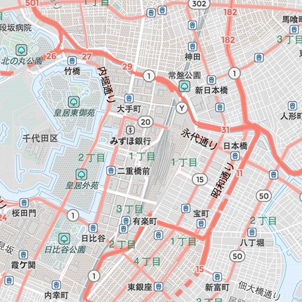
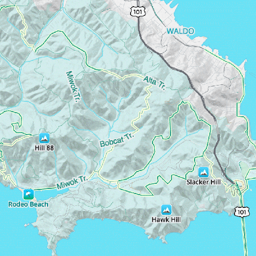
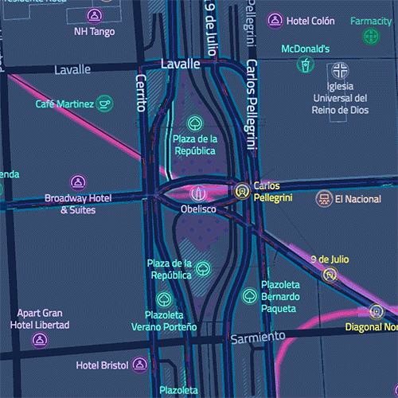
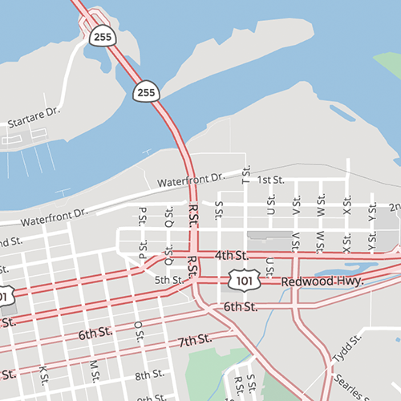
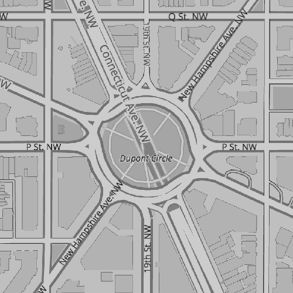

# Basemap Styles

Use gorgeous 2D and 3D basemap styles created by Mapzen's expert cartographers for Tangram.

As Mapzen's basemap styles are still in active development we recommend peggging an import to a specific **MAJOR** version, eg: `5`, so you enjoy any minor and patch updates but are ensured of stable named scene elements.

We only recommend pegging to the **LATEST** vesion if you are not modifying documented API scene elements.

## Bubble Wrap

A full-featured wayfinding style loaded with helpful icons for points of interest. See it in action in our very own [Eraser Map on Android](https://mapzen.com/blog/erasermap-beta/).

Bubble Wrap is only available in the "more labels" version.

**Supported:**

* Language
* Data visualization
* Transit overlay
* Default draw styles
* Basic user experience styles
* Transit user experience styles

**Not supported:**

* None

**Try Bubble Wrap:** [default](https://mapzen.com/products/maps/bubble-wrap)

Current **MAJOR** release (includes any minor and patch updates):

* `https://mapzen.com/carto/bubble-wrap-style/5/bubble-wrap.yaml`

**LATEST** (same assets as MAJOR version above):

* `https://mapzen.com/carto/bubble-wrap-style/bubble-wrap.yaml`

## Refill

A minimalist map style designed for data visualization overlays. Inspired by the seminal Toner style by Stamen Design.

**Supported:**

* Language
* Data visualization
* Default draw styles
* Basic user experience styles
* Transit user experience styles

**Not supported:**

* Transit overlay

**Try Refill:** [default](https://mapzen.com/products/maps/refill) | [more labels](https://mapzen.com/products/maps/refill/more-labels) | [no labels](https://mapzen.com/products/maps/refill/no-labels)

Current **MAJOR** versioned release (includes any minor and patch updates):

* `https://mapzen.com/carto/refill-style/4/refill-style.yaml`
* `https://mapzen.com/carto/refill-style-more-labels/5/refill-style-more-labels.yaml`
* `https://mapzen.com/carto/refill-style-no-labels/4/refill-style-no-labels.yaml`

**LATEST** (same assets as MAJOR version above):

* `https://mapzen.com/carto/refill-style/refill-style.yaml`
* `https://mapzen.com/carto/refill-style-more-labels/refill-style-more-labels.yaml`
* `https://mapzen.com/carto/refill-style-no-labels/refill-style-no-labels.yaml`

## Walkabout

This outdoor style is perfect for hiking or getting out and about, with mountains, ski trails, biking paths, and transit stops.

**Supported:**

* Data visualization
* Default draw styles
* Basic user experience styles
* Transit user experience styles

**Not supported:**

* Language
* Transit overlay

**Try Walkabout:** [default](https://mapzen.com/products/maps/walkabout) | [more labels](https://mapzen.com/products/maps/walkabout/more-labels) | [no labels](https://mapzen.com/products/maps/walkabout/no-labels)

Current **MAJOR** versioned release (includes any minor and patch updates):

* `https://mapzen.com/carto/walkabout-style/2/walkabout-style.yaml`
* `https://mapzen.com/carto/walkabout-style-more-labels/2/walkabout-style-more-labels.yaml`
* `https://mapzen.com/carto/walkabout-style-no-labels/2/walkabout-style-no-labels.yaml`

**LATEST** (same assets as MAJOR version above):

* `https://mapzen.com/carto/walkabout-style/walkabout-style.yaml`
* `https://mapzen.com/carto/walkabout-style-more-labels/walkabout-style-more-labels.yaml`
* `https://mapzen.com/carto/walkabout-style-no-labels/walkabout-style-no-labels.yaml`

## Tron

Will autonomous cars dream as they charge overnight? We’re pushing mapping to new extremes with Tron, and it will push your GPU and fan to the limit.

**Supported:**

* Language
* Data visualization
* Default draw styles
* Basic user experience styles
* Transit user experience styles

**Not supported:**

* Transit overlay

**Try Tron:** [default](https://mapzen.com/products/maps/tron) | [more labels](https://mapzen.com/products/maps/tron/more-labels) | [no labels](https://mapzen.com/products/maps/tron/no-labels)

Current **MAJOR** versioned release (includes any minor and patch updates):

* `https://mapzen.com/carto/tron-style/2/tron-style.zip`
* `https://mapzen.com/carto/tron-style-more-labels/2/tron-style-more-labels.zip`
* `https://mapzen.com/carto/tron-style-no-labels/2/tron-style-no-labels.zip`

**LATEST** (same assets as MAJOR version above):

* `https://mapzen.com/carto/tron-style/tron-style.zip`
* `https://mapzen.com/carto/tron-style-more-labels/tron-style-more-labels.zip`
* `https://mapzen.com/carto/tron-style-no-labels/tron-style-no-labels.zip`

## Cinnabar

A classic web map style for general mapping applications.

**Supported:**

* Default draw styles
* Data visualization
* Basic user experience styles
* Transit user experience styles

**Not supported:**

* Language
* Transit overlay

**Try Cinnabar:** [default](https://mapzen.com/products/maps/cinnabar) | [more labels](https://mapzen.com/products/maps/cinnabar/more-labels) | [no labels](https://mapzen.com/products/maps/cinnabar/no-labels)

Current **MAJOR** versioned release (includes any minor and patch updates):

* `https://mapzen.com/carto/cinnabar-style/4/cinnabar-style.yaml`
* `https://mapzen.com/carto/cinnabar-style-more-labels/5/cinnabar-style-more-labels.yaml`
* `https://mapzen.com/carto/cinnabar-style-no-labels/4/cinnabar-style-no-labels.yaml`

**LATEST** (same assets as MAJOR version above):

* `https://mapzen.com/carto/cinnabar-style/cinnabar-style.yaml`
* `https://mapzen.com/carto/cinnabar-style-more-labels/cinnabar-style-more-labels.yaml`
* `https://mapzen.com/carto/cinnabar-style-no-labels/cinnabar-style-no-labels.yaml`

## Zinc

A dark, minimalist style that helps bright data overlays stand out. A great alternative to Refill.

**Supported:**

* Default draw styles
* Data visualization
* Basic user experience styles
* Transit user experience styles

**Not supported:**

* Language
* Transit overlay

**Try Zinc:** [default](https://mapzen.com/products/maps/zinc) | [more labels](https://mapzen.com/products/maps/zinc/more-labels) | [no labels](https://mapzen.com/products/maps/zinc/no-labels)

Current **MAJOR** versioned release (includes any minor and patch updates):

* `https://mapzen.com/carto/zinc-style/4/zinc-style.yaml`
* `https://mapzen.com/carto/zinc-style-more-labels/4/zinc-style-more-labels.yaml`
* `https://mapzen.com/carto/zinc-style-no-labels/4/zinc-style-no-labels.yaml`

**LATEST** (same assets as MAJOR version above):

* `https://mapzen.com/carto/zinc-style/zinc-style.yaml`
* `https://mapzen.com/carto/zinc-style-more-labels/zinc-style-more-labels.yaml`
* `https://mapzen.com/carto/zinc-style-no-labels/zinc-style-no-labels.yaml`
